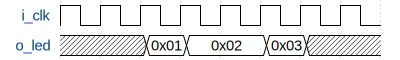

&nbsp;&nbsp;

# Entity: main
## Diagram

## Description
 Author: Imants Pulkstenis
 Date: 05.03.2020
 Project name: Delay line 
 Module name: Delay line TOP entity

 Detailed module description:
 

 Revision:
 A - initial design
 B - 

 ***Wavedrom*** example(not actual waveform):
 
 

## Generics and ports
### Table 1.1 Generics
| Generic name       | Type    | Value  | Description                                         |
| ------------------ | ------- | ------ | --------------------------------------------------- |
| g_DL_ELEMENT_COUNT | INTEGER | 24 * 4 |  delay element count in delay line. It must be n*4. |
### Table 1.2 Ports
| Port name | Direction | Type                          | Description                       |
| --------- | --------- | ----------------------------- | --------------------------------- |
| i_clk     | in        | STD_LOGIC                     |  100MHz clock                     |
| o_led     | out       | STD_LOGIC_VECTOR(15 DOWNTO 0) |  LEDs on Basys3 development board |
## Signals, constants and types
### Signals
| Name              | Type                                              | Description                                      |
| ----------------- | ------------------------------------------------- | ------------------------------------------------ |
| w_thermometer     | STD_LOGIC_VECTOR(g_DL_ELEMENT_COUNT - 1 DOWNTO 0) |  thermometer time code from primary delay line   |
| w_thermometer_sec | STD_LOGIC_VECTOR(g_DL_ELEMENT_COUNT - 1 DOWNTO 0) |  thermometer time code from secondary delay line |
## Processes
- **led_control**: ***( ALL )***
 This process controls LEDs on the board 

## Instantiations
- **delay_line_inst_main**: work.delay_line

- **delay_line_inst_sec**: work.delay_line
 secondary delay line
 

